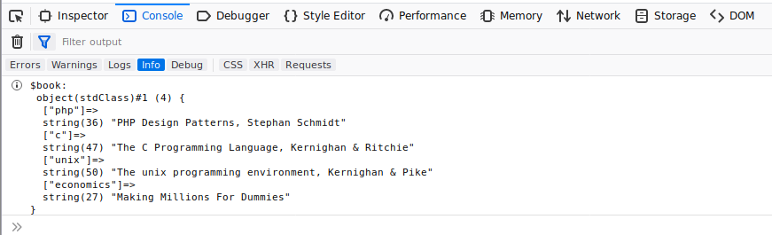

PHPDebugr
=========


**A debugging tool for inspecting variables.**

A quick and effective debugging tool/solution if you do not have access to (or don't want to use) a single-stepping  debugger like xdebug. 
Powerful 'var_dump' replacement with logging capabilities and console support.

## Usage ##

<code>
<b>Debugr::eDbg</b>(mixed <i>$var</i> [, string <i>$description</i> [, string <i>$writeOption</i>]])
</code>&nbsp;

`Debugr::eDbg` writes the value of `$var` and the `$description` text *(optional)* to the output, defined in `config.php`, using the `$writeOption`.
Possible options for the output are:  `Screen`, `Log`, `Console`, and `None`.  
*(The predefined value is `Screen`)*\
&nbsp;

<code>
<b>Debugr::eDbgScreen</b>(mixed <i>$var</i> [, string <i>$description</i> [, string <i>$writeOption</i>]])
</code>&nbsp;

`Debugr::eDbgScreen`  writes the value of `$var` to the screen regardless of the default `config.php` file entry\
&nbsp;

<code>
<b>Debugr::eDbgLog</b>(mixed <i>$var</i> [, string <i>$description</i> [, string <i>$writeOption</i>]])
</code>&nbsp;

`Debugr::eDbgLog`  writes the value of `$var` to the log file defined in `config.php`\
&nbsp;

<code>
<b>Debugr::eDbgConsole</b>(mixed <i>$var</i> [, string <i>$description</i> [, string <i>$writeOption</i>]])
</code>&nbsp;

`Debugr::eDbgConsole` writes the value of `$var` to the browsers console


### Parameters ###

***var***

The variable to inspect\
&nbsp;

***description***
*(optional)*

Text to be displayd before the variable value e.g.   `The value of $thisVar is:`\
&nbsp;

***writeOption***
*(optional)*

The way the output is written/formatted:


###### options: ######

>
`e` or `echoes` &ndash; *for `echo`-like output*  
`v` or `varDump`  &ndash; *for `var_dump`-like output*  
`r` or `printR` &ndash;  *for `print_r`-like output*  

If you omit this, the defaults are used. For scalar types *(integer, double, string)* the default is `echoes` and for composite types *(array, object, resource, boolean, null, unknown type*) the default is `varDump`. The defaults can be changed in the `config.php` file.  
*(I know boolean is technically scalar and Null is, well, Null, but they are fitting better in the composite group)*

## Notes ##
If `None` is used as the default output, `Debugr::eDbg` will not produce any output. This is not true for `eDbgScreen`, `eDbgLog`, `eDbgConsole`.
You can disable all by settting: `disable:true` in `config.php`.  This is some sort of kill switch.

## Install ##

Composer or no composer? That is the question!

**composer:**  
```
composer require nikoutel/phpdebugr
```

<br />

**no composer:**  
Just dump the files in you project and use as shown below.
```php
require('path/to/Debugr/src/Debugr.php');
use Nikoutel\Debugr\Debugr;
```

## How to use ##

Use `eDbg` to output the variable values to the default output. On a developer server you can choose `Screen`. If you have to use it on a production server use `Log` and all `Debugr::eDbg` calls will now write to the log file instead of the screen.

On some occasions e.g. when outputting a variable on screen breaks the site layout you can use `eDbgConsole` to use the browser console regardless of the default output. In the same way you can use `eDbgScreen`, `eDbgLog`, according to the situation and your needs.

The value is formatted according to the variables type or the `writeOption` given.

## Requirements ##

Required PHP 5.3 (min)

## Examples ##


```php
require('path/to/Debugr/src/Debugr.php');
use Nikoutel\Debugr\Debugr;
```

>
> ```php
> $varB = 42;
> Debugr::edbg($varB);
> ```
> 42

<br />

> ```php
> $varC = 103993/33102;
> Debugr::edbg($varC, 'the value of pi is');
> ```
> the value of pi is: 3.1415926530119

<br />

> ```php
> $varA = 'Guru Meditation';
> Debugr::edbg($varA, NULL, 'v');
> ```
> string(15) "Guru Meditation"

<br /> 

> ```php
> $varE = array(
>     'black jack',
>     'gin rummy',
>     'hearts',
>     'bridge',
>     'checkers',
>     'cess',
>     'global thermonuclear war');
> Debugr::edbg($varE, 'Shall we play a game?','r');
> ```
> <pre>
> >Shall we play a game?:
> Array
> (
>     [0] => black jack
>     [1] => gin rummy
>     [2] => hearts
>     [3] => bridge
>     [4] => checkers
>     [5] => cess
>     [6] => global thermonuclear war
> )
> </pre>

<br />

> ```php
> $varF = fopen('secretFile.xml', 'r');
> Debugr::edbgLog($varF);
> fclose($varF);
> Debugr::edbgLog($varF);
> ```
> will produce a log file entry:
> 
> ```
> (18/10/2017 17:23:58) /LondonBlue/Secret/getSecret.php
> resource(19) of type (stream)
> 
> (18/10/2017 17:23:58) /LondonBlue/Secret/getSecret.php
> resource(19) of type (Unknown)
> ```


> ```php
> $book = new stdClass;
> $book->php = 'PHP Design Patterns, Stephan Schmidt';
> $book->c = 'The C Programming Language, Kernighan & Ritchie';
> $book->unix = 'The unix programming environment, Kernighan & Pike';
> $book->economics = 'Making Millions For Dummies';
> Debugr::edbgConsole($book, '$book');
> ```
> will produce a console output:
> 
> 

## Licence ##
This software is licensed under the [MPL-2.0](http://www.mozilla.org/MPL/2.0/):
```
    This Source Code Form is subject to the terms of the Mozilla Public
    License, v. 2.0. If a copy of the MPL was not distributed with this
    file, You can obtain one at http://mozilla.org/MPL/2.0/.
```


